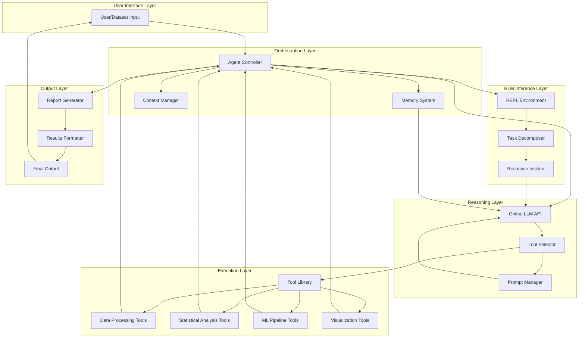
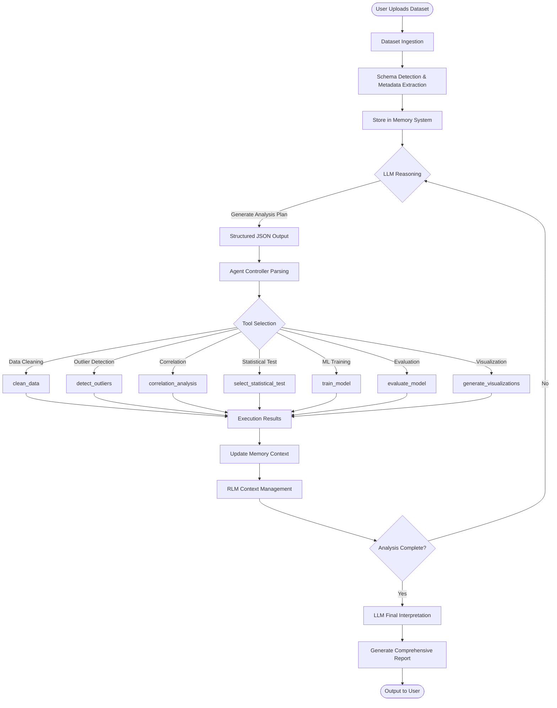
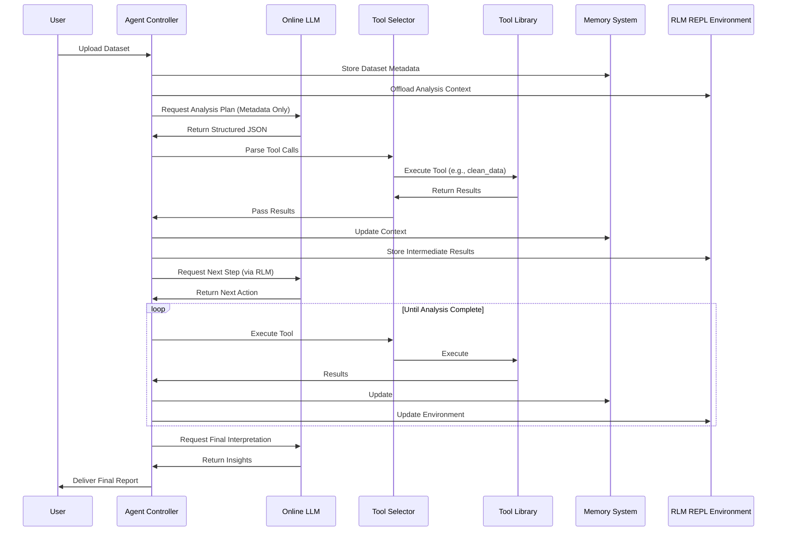
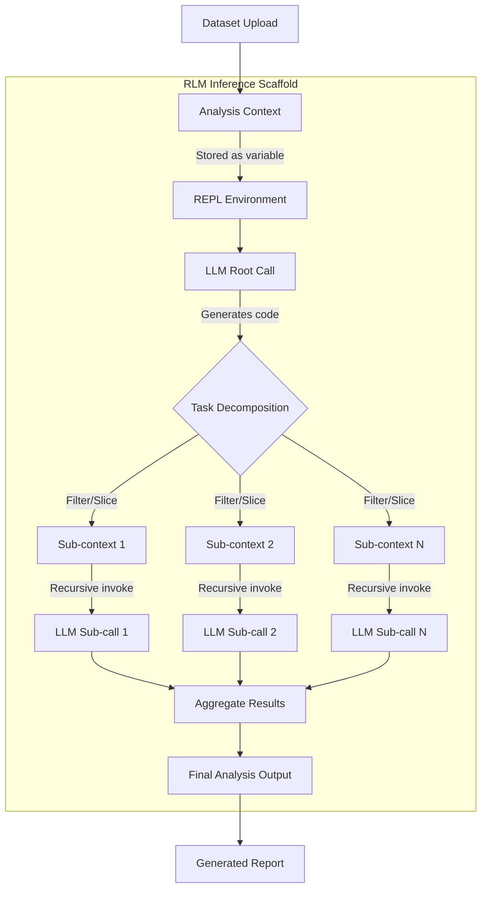
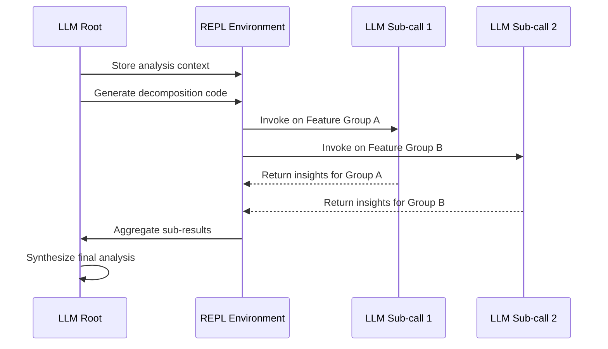
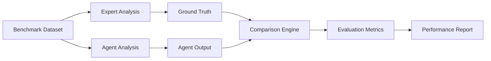

# Agentic AI Powered Autonomous Data Analysis and Interpretation System

[](https://www.python.org/)
[](LICENSE)
[]()

## Project Overview

This project implements an autonomous AI agent system that performs end-to-end data analysis on user-uploaded datasets. The system leverages large language models (LLMs) for intelligent reasoning and tool orchestration, while delegating computational tasks to specialized Python modules. By separating reasoning from execution, the architecture achieves modularity, scalability, and interpretability in automated data science workflows.

The core innovation lies in the integration of **Recursive Language Model (RLM)** inference patterns, enabling the agent to handle arbitrarily complex analytical workflows. Drawing from recent research (Zhang et al., 2024), RLM is an inference-time paradigm that treats long analysis contexts as part of an external environment, allowing the LLM to programmatically decompose tasks, recursively invoke itself on workflow segments, and process analysis pipelines beyond standard context window limitations. This approach enhances the system's ability to manage multi-step data science workflows with improved efficiency and reduced context saturation.

---

## Problem Statement

Traditional data analysis workflows require significant human expertise to select appropriate statistical tests, machine learning models, and visualization techniques. Manual processes are:

- **Time-consuming**: Hours spent on exploratory analysis and model selection
- **Error-prone**: Incorrect statistical test selection and assumption violations
- **Inaccessible**: Requires advanced domain knowledge in statistics and ML
- **Non-scalable**: Struggles with complex multi-step workflows requiring extensive context management

There is a critical need for an autonomous system that can intelligently interpret dataset characteristics, plan and execute multi-step analytical workflows, handle arbitrarily complex analysis pipelines, and provide interpretable natural language explanations of findings.

---

## Objectives

- Develop an agentic AI system that autonomously performs comprehensive data analysis from raw datasets to actionable insights
- Implement a modular architecture that strictly separates reasoning (LLM) from execution (Python tools) for maintainability and scalability
- Apply Recursive Language Model (RLM) inference patterns to handle complex multi-step analytical workflows beyond standard context limitations
- Achieve high accuracy in statistical testing, model selection, and insight generation comparable to expert-level analysis
- Ensure system interpretability through natural language explanations and structured reporting
- Enable deployment-ready architecture suitable for production environments

---

## System Architecture

### High-Level Architecture Diagram



### Detailed Data Flow Diagram



### Component Interaction Sequence



---

## Agent Workflow Explanation

The agent operates through an iterative **reasoning-execution cycle** that combines LLM-based planning with deterministic Python execution:

### Workflow Stages

1. **Dataset Ingestion**
   - User uploads dataset in CSV/Excel format
   - System performs automatic schema detection
   - Extracts metadata: column types, missing values, statistical summaries
   - Stores in memory context for persistent access

2. **Initial Reasoning Phase**
   - LLM analyzes dataset characteristics from metadata
   - Generates multi-step analysis plan as structured JSON
   - Plans include tool names, parameters, and execution order

3. **Tool Selection & Execution**
   - Agent Controller parses JSON to identify required tools
   - Tool Selector maps abstract tool names to concrete Python functions
   - Executes tools with specified parameters
   - Captures outputs and error states

4. **Result Interpretation**
   - LLM reviews execution outputs in context of analysis goals
   - Updates reasoning state based on findings
   - Decides whether to iterate or proceed to next analysis phase

5. **Iterative Refinement**
   - Cycle repeats for multi-step analyses (e.g., clean → EDA → model → evaluate)
   - Memory system maintains coherent state across iterations
   - Error handling triggers re-planning when tools fail

6. **RLM Workflow Management**
   - Complex analysis workflows decomposed into manageable sub-tasks
   - Recursive invocation of reasoning on workflow segments
   - Programmatic handling of arbitrarily long analysis chains

7. **Report Generation**
   - LLM synthesizes final insights from all analysis steps
   - Generates natural language explanations
   - Compiles structured report with visualizations and recommendations

---

## Recursive Language Model (RLM) Integration

This system implements **Recursive Language Model (RLM)** inference patterns based on research by Zhang et al. (2024). RLM is an **inference-time paradigm** (not a trained model or reinforcement learning system) that enables processing of complex, multi-step analytical workflows beyond standard LLM context window limitations.

### What is RLM?

**Definition** (Zhang et al., 2024):  
> "Recursive Language Models (RLMs), a general inference paradigm that treats long prompts as part of an external environment and allows the LLM to programmatically examine, decompose, and recursively call itself over snippets of the prompt."

In the context of this data analysis system:
- The **"long prompt"** = cumulative analysis context (dataset metadata, intermediate results, prior steps)
- The **"external environment"** = REPL-like execution environment storing workflow state
- **"Recursive calls"** = LLM invokes itself on sub-problems (e.g., analyzing specific feature subsets)

### RLM Architecture in This System



### How RLM Works in Data Analysis

#### 1. Context Offloading
Instead offilling the LLM context window with the entire analysis history:
```python
# Traditional approach (context overflow risk)
llm_call(full_dataset + metadata + all_prior_results + current_question)

# RLM approach (scalable)
repl_env = {
    'dataset': dataset,
    'metadata': metadata,
    'results_history': results,
    'current_step': step_number
}
llm_call(metadata_summary_only + repl_access_code)
```

#### 2. Programmatic Task Decomposition
The LLM generates Python code to examine and decompose the workflow:
```python
# Example LLM-generated code in RLM paradigm
# Decompose multi-variate analysis into feature groups
feature_groups = categorize_features(metadata)
sub_analyses = []

for group in feature_groups:
    # Recursively invoke LLM on each feature subset
    result = llm_recursive_call(f"Analyze {group} features", 
                                  data=dataset[group])
    sub_analyses.append(result)

final_insights = synthesize(sub_analyses)
```

#### 3. Recursive Invocation
The system enables the LLM to invoke itself on workflow segments:



### RLM Benefits for Data Analysis

1. **Unbounded Workflow Length**
   - Handles analyses with arbitrarily many steps without context window overflow
   - Example: 50-step ML pipeline with intermediate validation and logging

2. **Reduced Context Saturation**
   - Only relevant context portions loaded for each reasoning step
   - Minimizes "context rot" where LLMs degrade with long contexts

3. **Parallel Sub-Analysis**
   - Different feature groups or dataset partitions analyzed independently
   - Results aggregated programmatically

4. **Error Isolation**
   - Failed sub-tasks contained without corrupting entire analysis
   - Targeted retry mechanisms for specific workflow segments

5. **Interpretable Decomposition**
   - Clear provenance of how complex analysis was broken down
   - Each recursive call has explicit input/output boundaries

### Implementation Highlights

The system implements three core RLM design principles from Zhang et al. (2024):

**Principle 1: Symbolic Prompt Handling**
- Analysis context stored as Python dictionaries/objects in execution environment
- LLM receives metadata summaries, not full context
- Enables processing contexts far exceeding model token limits

**Principle 2: Programmatic Recursion**
- LLM generates code that explicitly invokes `llm_recursive_call(sub_prompt, sub_context)`
- Sub-calls parameterized by specific data slices or workflow stages
- Supports loops over dataset partitions or feature combinations

**Principle 3: Persistent REPL State**
- Workflow state maintained across LLM invocations
- Intermediate results stored in environment variables
- Final output assembled from programmatically accumulated sub-results

### Example: RLM-Enhanced Multi-Step Analysis

**Scenario**: Analyzing 100-feature cancer prediction dataset

**Traditional Approach** (context window issues):
```
LLM Input: [Full dataset + 100 feature descriptions + analysis requirements]
→ Context overflow or degraded performance on complex reasoning
```

**RLM Approach** (scalable decomposition):
```python
# Root LLM call (receives only metadata)
def analyze_cancer_data(metadata):
    # LLM generates this decomposition code
    feature_groups = {
        'clinical': metadata.filter(type='clinical'),
        'genetic': metadata.filter(type='genetic'),
        'imaging': metadata.filter(type='imaging')
    }
    
    results = {}
    for group_name, features in feature_groups.items():
        # Recursive sub-call per group
        analysis = llm_recursive_call(
            prompt=f"Analyze {group_name} features for cancer prediction",
            context={'features': features, 'target': 'diagnosis'}
        )
        results[group_name] = analysis
    
    # Synthesize across groups
    final_model = ll<sub-call(
        prompt="Build ensemble model from group analyses",
        context=results
    )
    
    return final_model
```

### RLM vs Traditional Agentic Systems

| Aspect | Traditional Agent | RLM-Enhanced Agent |
|--------|------------------|-------------------|
| **Context Handling** | Linear accumulation in context window | Offloaded to external environment |
| **Task Decomposition** | Verbalized in natural language | Programmatic with explicit code |
| **Sub-task Execution** | Sequential with full context | Recursive with minimal context |
| **Scalability** | Limited by context window (~128K tokens) | Unbounded (processes 10M+ token workflows) |
| **Error Recovery** | Retry entire workflow | Retry specific failed sub-calls |

### References

This implementation is inspired by:

**Zhang, A. L., Kras Timka, T., & Khattab, O. (2024)**. *Recursive Language Models*. arXiv preprint arXiv:2512.24601v2.  
Key contributions:
- Formal definition of RLM as inference-time scaffold
- Algorithm for REPL-based prompt offloading
- Empirical validation on long-context reasoning tasks

---

## Core Features

### Intelligent Analysis Capabilities

- **Automatic Dataset Schema Detection**: Intelligent type inference, encoding detection, and metadata extraction
- **Missing Value Analysis**: Comprehensive gap identification with imputation strategy recommendations
- **Outlier Detection**: Multi-method anomaly identification (Z-score, IQR, Isolation Forest)
- **Autonomous EDA**: Automated exploratory data analysis with distribution profiling and pattern discovery
- **Intelligent Statistical Test Selection**: Context-aware selection of appropriate hypothesis tests (t-test, ANOVA, chi-square, etc.)
- **Automatic ML Task Detection**: Identifies classification, regression, or clustering requirements
- **Model Selection & Evaluation**: Comparative training of multiple models with cross-validation
- **Natural Language Interpretation**: LLM-powered explanation generation for technical findings

### System Engineering Features

- **Structured Report Generation**: Automated creation of comprehensive analysis documents
- **Multi-step Reasoning**: Complex workflow orchestration with dependency management
- **Tool-based Orchestration**: Modular execution architecture with hot-swappable components
- **RLM Inference Optimization**: Recursive task decomposition for complex workflows
- **Error Recovery**: Automatic retry mechanisms and fallback strategies
- **Memory Management**: Efficient context storage for long analysis sessions
- **Extensible Architecture**: Plugin-based tool addition without core system modifications

---

## Technology Stack

### Core Technologies

| Component | Technology | Purpose |
|-----------|-----------|---------|
| **Language** | Python 3.11+ | Primary implementation language |
| **Data Processing** | pandas, NumPy | Dataset manipulation and numerical computation |
| **Statistical Analysis** | SciPy, StatsModels | Hypothesis testing and statistical modeling |
| **Machine Learning** | scikit-learn | Model training, evaluation, and preprocessing |
| **Visualization** | Matplotlib, Seaborn | Chart generation and visual analytics |
| **LLM Integration** | OpenAI API / Anthropic Claude | Reasoning engine and natural language generation |
| **Data Interchange** | JSON | Structured tool call specification |
| **Environment Management** | virtualenv / conda | Dependency isolation |

### Architecture Pattern

- **Design Pattern**: Agent-based architecture with tool-augmented LLM
- **Execution Model**: Synchronous reasoning, asynchronous tool execution
- **State Management**: In-memory context with optional persistent storage
- **Communication**: RESTful API calls to LLM services

---

## Installation Instructions

### Prerequisites

- Python 3.11 or higher
- pip package manager
- Virtual environment tool (venv or conda)
- API key from a supported LLM provider (OpenAI, Anthropic, or OpenRouter) —
  optional for the dry-run validation, required for live analysis

### Setup Steps

1. **Clone the Repository**
   ```bash
   git clone https://github.com/shahdaksh050/agentic-data-analysis.git
   cd agentic-data-analysis
   ```

2. **Create Virtual Environment**
   ```bash
   # Using venv
   python -m venv .venv

   # Activate on Windows
   .venv\Scripts\activate

   # Activate on Linux/Mac
   source .venv/bin/activate
   ```

3. **Install Dependencies**
   ```bash
   pip install -r requirements.txt
   ```

4. **Configure Environment Variables**
   ```bash
   # Create .env file
   cp .env.example .env

   # Edit .env and add your API key
   OPENAI_API_KEY=your_api_key_here
   LLM_MODEL=gpt-4o
   MAX_ITERATIONS=10
   ```

5. **Verify Installation (no API key required)**
   ```bash
   # Unit + integration tests
   python -m pytest tests/

   # Full 7-stage workflow dry-run with a mock LLM
   python scripts/validate.py
   ```

---

## Usage Instructions

### Basic Usage (CLI)

```bash
# Run on the bundled sample dataset
python main.py --dataset data/sample_customer_churn.csv --target churn

# All options
python main.py --dataset path/to/data.csv \
    --provider openai            # openai | anthropic (default: openai)
    --model gpt-4o               # override the LLM model name
    --target churn               # target column (auto-detected when omitted)
    --max-iterations 15          # reasoning-execution cycles
    --no-rlm                     # disable Stage 6 RLM decomposition
    --output-dir output          # root directory for all artifacts
    --persist memory.json        # persist the memory state to disk
```

If the LLM is unreachable mid-run, the agent degrades gracefully: it executes a
deterministic fallback plan (clean → outliers → correlation → train → evaluate)
and synthesises the final report directly from tool outputs.

### Web UI (Streamlit)

```bash
streamlit run app.py
```

Upload a CSV/Excel file in the sidebar, paste your API key (OpenAI, Anthropic,
or OpenRouter), tune the anti-overfitting controls, and click **Run Analysis**.
Results render as an interactive dashboard (Vega-Lite charts, model comparison,
insights, and downloadable artifacts).

### Access Results

- Final report (Markdown): `output/reports/<dataset>_report.md`
- Raw report data (JSON): `output/reports/<dataset>_raw.json` and `output/reports/final_report.json`
- Visualizations: `output/visualizations/*.png`
- Trained models: `output/models/*.pkl`

### Configuration (environment variables)

All behaviour is configured through `.env` (see `.env.example`):

| Variable | Default | Purpose |
|----------|---------|---------|
| `LLM_PROVIDER` | `openai` | `openai` \| `anthropic` \| `openrouter` |
| `LLM_MODEL` | `gpt-4o` | Model name |
| `LLM_TEMPERATURE` | `0.2` | Sampling temperature |
| `LLM_MAX_TOKENS` | `4096` | Response token cap |
| `MAX_ITERATIONS` | `15` | Max reasoning-execution cycles |
| `ENABLE_RLM_INFERENCE` | `true` | Stage 6 task decomposition |
| `RLM_MAX_DEPTH` | `5` | Max recursion depth for sub-calls |
| `OUTPUT_DIR` | `output` | Root output directory |
| `TARGET_COLUMN_HINT` | — | Optional target column override |

### Programmatic Usage

```python
from src.core.controller import AgentController

# Initialize agent (reads provider/key from environment)
agent = AgentController(max_iterations=10, enable_rlm=True)

# Stage 1: ingest dataset (metadata only goes to the LLM)
metadata = agent.load_dataset("customer_data.csv", target_hint="churn")

# Stages 2-7: autonomous analysis
report = agent.analyze()

print(report["best_model"])
print(report["insights"])
print(report["key_metrics"])
```

---

## Example Workflow

### Scenario: Customer Churn Prediction

**Input Dataset**: `customer_data.csv` (10,000 rows × 15 features)
- Demographics: age, income, location
- Behavior: purchase_frequency, avg_transaction_value
- Target: churn_status (binary)

### Execution Trace

1. **Dataset Ingestion** (t=0s)
   ```
   ✓ Schema detected: 12 numerical, 3 categorical features
   ✓ Target identified: churn_status (classification task)
   ✓ Missing values: 3.2% overall
   ```

2. **Initial Reasoning** (t=2s)
   ```
   LLM Plan:
   Step 1: Handle missing values
   Step 2: Detect outliers in numerical features
   Step 3: Analyze feature correlations
   Step 4: Select and train classification models
   Step 5: Evaluate and compare performance
   ```

3. **Execution Phase 1: Data Cleaning** (t=5s)
   ```
   Tool: clean_data(strategy='median_imputation')
   Result: Missing values imputed, 9,683 clean rows
   ```

4. **Execution Phase 2: Outlier Detection** (t=8s)
   ```
   Tool: detect_outliers(method='isolation_forest')
   Result: 127 outliers detected (1.3%), flagged for analysis
   ```

5. **Execution Phase 3: Correlation Analysis** (t=12s)
   ```
   Tool: correlation_analysis(method='pearson')
   Result: High correlation between purchase_frequency and churn (r=-0.68)
   ```

6. **Execution Phase 4: ML Task Detection & Training** (t=15s)
   ```
   Tool: train_model(models=['random_forest', 'xgboost', 'logistic_regression'])
   Result: 
     - Random Forest: Accuracy=0.87, F1=0.84
     - XGBoost: Accuracy=0.89, F1=0.86
     - Logistic Regression: Accuracy=0.82, F1=0.79
   ```

7. **RLM Workflow Synthesis** (t=45s)
   ```
   RLM Decomposition Summary:
   ✓ Analysis decomposed into 5 independent sub-tasks
   ✓ Feature groups processed via recursive LLM sub-calls
   ✓ Intermediate results aggregated programmatically
   ✓ Total context processed: ~2.3M tokens (across all sub-calls)
   ✓ Root LLM context usage: 48K tokens (95% reduction via RLM)
   ```

8. **Final Report Generation** (t=50s)
   ```
   Key Insights:
   - Purchase frequency is strongest churn predictor
   - Customers with <2 purchases/month show 73% churn rate
   - XGBoost model recommended for deployment (89% accuracy)
   - Suggested intervention: Loyalty program for low-frequency users
   ```

### Output Files

- `output/reports/customer_churn_analysis.pdf` (12 pages)
- `output/visualizations/correlation_matrix.png`
- `output/visualizations/feature_importance.png`
- `output/models/xgboost_final.pkl`
- `output/raw/complete_results.json`

---

## Evaluation Strategy

The system is evaluated across multiple dimensions to ensure robustness, accuracy, and efficiency.

### Evaluation Metrics

#### 1. Tool Selection Accuracy
- **Precision**: Proportion of selected tools that were appropriate
- **Recall**: Proportion of necessary tools that were selected
- **F1-Score**: Harmonic mean of precision and recall
- **Target**: >90% F1-score on benchmark datasets

#### 2. Model Performance Metrics
- **Classification**: Accuracy, Precision, Recall, F1-score, ROC-AUC
- **Regression**: RMSE, MAE, R²
- **Clustering**: Silhouette score, Davies-Bouldin index
- **Target**: Within 5% of expert-selected models

#### 3. Statistical Correctness
- **Test Assumption Validation**: Normality, homoscedasticity checks
- **P-value Interpretation**: Correct significance conclusions
- **Effect Size Reporting**: Cohen's d, η² where appropriate
- **Target**: 95% correctness on statistical test battery

#### 4. Report Quality Scoring
- **Semantic Coherence**: BERT similarity to ground truth insights
- **Completeness**: Coverage of all significant findings
- **Actionability**: Presence of concrete recommendations
- **Target**: >0.85 coherence score

#### 5. Execution Efficiency
- **Analysis Time**: Total time from upload to report
- **Redundant Operations**: Repeated tool calls providing no value
- **Memory Usage**: Peak RAM consumption
- **Target**: <5 minutes for datasets <100K rows, <2% redundancy

#### 6. RLM Inference Efficiency
- **Context Reduction**: Percentage of context offloaded to external environment
- **Workflow Scalability**: Maximum handled workflow complexity (number of steps)
- **Sub-call Effectiveness**: Quality of task decomposition (measured by final accuracy)
- **Target**: 90%+ context reduction, handle 100+ step workflows without degradation

### Benchmark Datasets

- **Kaggle Competitions**: Titanic, House Prices, Credit Default
- **UCI Repository**: Iris, Wine Quality, Adult Income
- **Synthetic Data**: Controlled scenarios with known optimal paths
- **Custom Datasets**: Industry-specific analysis challenges

### Validation Methodology



---

## Future Scope

### Near-Term Enhancements

1. **Offline LLM Migration**
   - Transition to local models (Llama 3, Mistral, GPT-J)
   - Benefits: Enhanced privacy, reduced latency, zero API costs
   - Implementation: Model quantization for efficient edge deployment

2. **Multi-modal Analysis Support**
   - Image data: CNN-based feature extraction
   - Text data: NLP pipelines with sentiment analysis
   - Time-series: ARIMA, Prophet forecasting integration

3. **Interactive Refinement Interface**
   - Human-in-the-loop capability for expert guidance
   - Real-time plan modification during execution
   - Conversational debugging of analysis steps

### Medium-Term Goals

4. **Distributed Execution Framework**
   - Parallel processing for large-scale datasets (>10M rows)
   - Spark/Dask integration for distributed computing
   - Cloud deployment with auto-scaling

5. **Domain Specialization**
   - Healthcare: Survival analysis, clinical trial tools
   - Finance: Risk modeling, portfolio optimization
   - Retail: Market basket analysis, demand forecasting

6. **Native RLM Model Training**
   - Fine-tune models to operate natively as RLMs (following Zhang et al., 2024)
   - Improve programmatic task decomposition capabilities
   - Enable more efficient recursive invocation patterns

### Long-Term Vision

7. **Autonomous Research Assistant**
   - Literature review integration
   - Hypothesis generation and experimental design
   - Automated A/B test planning

8. **Explainable AI Dashboard**
   - Interactive visualization of reasoning steps
   - Counterfactual explanations for model predictions
   - Bias detection and fairness auditing

9. **Collaborative Multi-Agent System**
   - Specialized agents for different domains
   - Consensus-based decision making
   - Competitive analysis with ensemble insights

---

## Skills Demonstrated

This project showcases expertise across multiple domains critical for modern AI engineering:

### AI & Machine Learning
- **Agentic AI Systems**: Design and implementation of autonomous decision-making agents
- **Recursive Language Models**: Inference-time optimization for complex workflow handling
- **LLM Integration**: Prompt engineering, structured output parsing, API orchestration
- **Statistical Analysis**: Hypothesis testing, effect size calculation, assumption validation
- **ML Pipeline Development**: End-to-end model training, evaluation, and deployment

### Software Engineering
- **System Architecture**: Modular design with clear separation of concerns
- **Design Patterns**: Agent pattern, strategy pattern, factory pattern
- **Error Handling**: Robust retry mechanisms and graceful degradation
- **Testing**: Unit tests, integration tests, benchmark validation
- **Documentation**: Comprehensive technical documentation and code comments

### Data Science
- **Exploratory Data Analysis**: Automated pattern discovery and insight generation
- **Feature Engineering**: Automated feature selection and transformation
- **Model Selection**: Multi-model comparison with appropriate metrics
- **Visualization**: Automated chart generation with publication-quality output
- **Report Generation**: Structured communication of technical findings

### DevOps & Deployment
- **Environment Management**: Dependency isolation and reproducible builds
- **Configuration Management**: YAML/JSON-based system configuration
- **Logging & Monitoring**: Structured logging for debugging and performance tracking
- **API Integration**: RESTful service consumption and error handling

### Research & Innovation
- **Literature Review**: Understanding of current agentic AI research
- **Problem Formulation**: Translation of real-world needs to technical requirements
- **Algorithm Design**: Custom reinforcement learning mechanism development
- **Evaluation Methodology**: Comprehensive multi-dimensional assessment framework

---

## Contributing

Contributions are welcome! Please follow these guidelines:

1. Fork the repository
2. Create a feature branch (`git checkout -b feature/AmazingFeature`)
3. Commit changes (`git commit -m 'Add AmazingFeature'`)
4. Push to branch (`git push origin feature/AmazingFeature`)
5. Open a Pull Request

Please ensure:
- Code follows PEP 8 style guidelines
- All tests pass (`pytest tests/`)
- New features include unit tests
- Documentation is updated accordingly

---

## License

This project is licensed under the MIT License - see the [LICENSE](LICENSE) file for details.

### MIT License Summary

Permission is hereby granted to use, copy, modify, merge, publish, distribute, sublicense, and/or sell copies of this software, subject to the following conditions:

- The above copyright notice and this permission notice shall be included in all copies or substantial portions of the Software.
- THE SOFTWARE IS PROVIDED "AS IS", WITHOUT WARRANTY OF ANY KIND.

---

## Acknowledgments

- **LLM Providers**: OpenAI, Anthropic for API access
- **Open Source Community**: Contributors to pandas, scikit-learn, and visualization libraries
- **Academic Research**: 
  - Zhang et al. (2024) for Recursive Language Models framework
  - Papers on agentic AI and tool-augmented LLMs

---

## Contact & Support

**Developer**: Daksh Shah  
**Email**: shahdaksh050@gmail.com 
**GitHub**: [@shahdaksh050](https://github.com/shahdaksh050)  

For bug reports and feature requests, please open an issue on GitHub.

---

## Citation

If you use this project in your research or application, please cite:

```bibtex
@software{agentic_data_analysis_2026,
  author = {Daksh Shah},
  title = {Agentic AI Powered Autonomous Data Analysis and Interpretation System},
  year = {2026},
  url = {https://github.com/shahdaksh050/agentic-data-analysis}
}
```

If you use the RLM inference patterns, please also cite the original paper:

```bibtex
@article{zhang2024recursive,
  title={Recursive Language Models},
  author={Zhang, Alex L. and Kraşka, Tim and Khattab, Omar},
  journal={arXiv preprint arXiv:2512.24601},
  year={2024},
  url={https://arxiv.org/abs/2512.24601}
}
```

---

## References

**Zhang, A. L., Kraşka, T., & Khattab, O. (2024).** Recursive Language Models. *arXiv preprint arXiv:2512.24601v2*.  
Available at: https://arxiv.org/html/2512.24601v2  

Key contributions from this paper:
- Formal definition of RLM as an inference-time scaffold architecture
- Algorithm for REPL-based prompt offloading to external environments
- Three core design principles: symbolic prompt handling, programmatic recursion, and persistent state management
- Empirical demonstration of scaling to 10M+ token contexts without performance degradation

---

<div align="center">

**Built with ❤️ for autonomous data science**

[⬆ Back to Top](#agentic-ai-powered-autonomous-data-analysis-and-interpretation-system)

</div>
